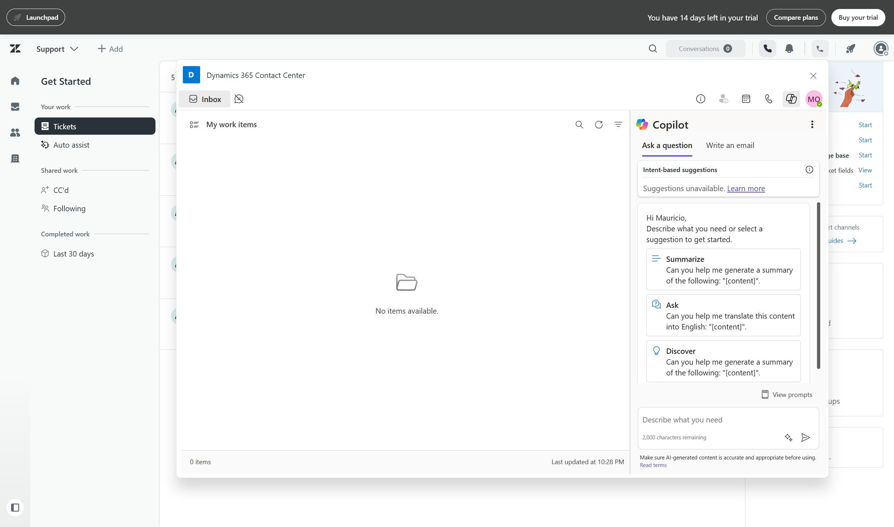
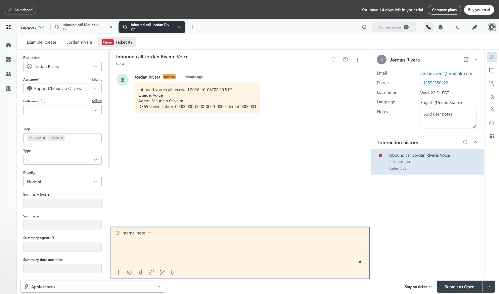
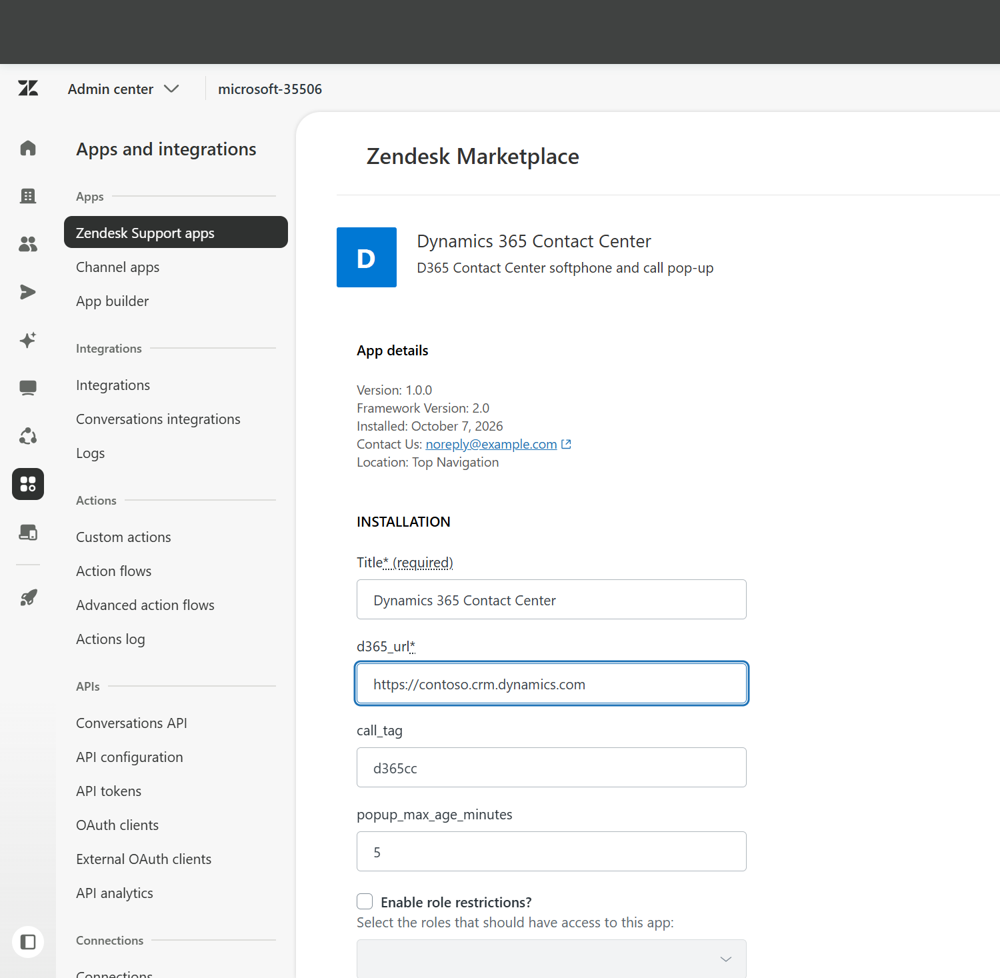
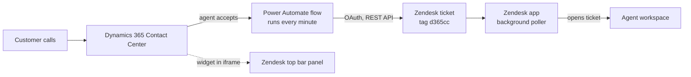

# Dynamics 365 Contact Center ✕ Zendesk — Call Journey

**Your agents work in Zendesk. Your calls run on Dynamics 365 Contact Center.**
This community project connects the two:

- the **Dynamics 365 Contact Center panel** (answer calls, presence, Copilot) opens inside Zendesk, in the top bar
- every call an agent accepts creates a **Zendesk ticket** with the caller, queue, agent and the Dynamics 365 conversation ID
- the ticket **opens by itself** for the agent (a "screen pop"), with the customer's profile beside it





> **Status: first version (1.0.0).** It covers the panel, the ticket and the pop-up. It does **not** yet have the call-journey card, the recording and transcript button, or the quality score that the [ServiceNow](https://github.com/moliveirapinto/d365-contact-center-servicenow-call-journey) and [Salesforce](https://github.com/moliveirapinto/d365-contact-center-salesforce-call-journey) versions have. See [Limits](#limits-and-known-gaps).

> 🧩 Everything is **ready to install**: one `.zip` for Zendesk, one `.zip` for Dynamics 365. No coding. Prefer to hand it over? [Let an AI assistant install it for you](#let-an-ai-assistant-install-the-call-journey).

---

## Table of contents

1. [What you get](#what-you-get)
2. [How it works](#how-it-works)
3. [Before you start](#before-you-start) (including how to get a free Zendesk account)
4. [Need help installing the Zendesk connector?](#need-help-installing-the-zendesk-connector)
5. [Let an AI assistant install the call journey](#let-an-ai-assistant-install-the-call-journey)
6. [Install, step by step](#install-step-by-step)
7. [Test it](#test-it)
8. [Troubleshooting](#troubleshooting)
9. [Limits and known gaps](#limits-and-known-gaps)
10. [What is in this repository](#what-is-in-this-repository)
11. [Uninstall](#uninstall)
12. [Disclaimer and license](#disclaimer-and-license)

---

## What you get

| Where | What |
|---|---|
| **Zendesk top bar** | A phone icon that opens the Dynamics 365 Contact Center conversation widget (up to 1200 × 720). The agent signs in once with their Microsoft account. |
| **Zendesk tickets** | One ticket per accepted voice call, tagged `d365cc` and `voice`, with a **private** note (queue, agent, time, Dynamics 365 conversation ID). The caller is matched to a Zendesk user by the Dynamics 365 contact's name, email and phone. |
| **Zendesk screen pop** | The ticket opens in the agent's workspace within a few seconds of being created, and is assigned to that agent if nobody owns it. |
| **Dynamics 365** | A solution with one Power Automate flow, three environment variables and one connection reference. |



## How it works



1. The **flow** looks every minute for voice conversations from the last 30 minutes that an agent has accepted (ended calls included, so a short call is not missed).
2. For each one it asks Zendesk whether a ticket with that conversation ID already exists. If not, it finds or creates the **requester** and creates the **ticket**. Because it checks first, it never creates two tickets for one call.
3. It signs in to Zendesk with an **OAuth client** (client-credentials grant). No API token and no password are used; Zendesk is retiring API tokens on April 30, 2027.
4. The **Zendesk app** has a background part that checks every 5 seconds for new tickets with the tag `d365cc`, and opens the newest ones for the logged-in agent. It also has the top-bar part, which shows the Dynamics 365 widget.
5. The widget address comes from your Dynamics 365 environment URL: `https://ccaas-embed-prod.azureedge.net/widget/index.html?dynamicsUrl=https://<your org>.crm.dynamics.com`.

## Before you start

You need:

| ✔ | Requirement |
|---|---|
| ☐ | **Zendesk Support** with the Agent Workspace and permission to **upload private apps** and to create **OAuth clients** (a Zendesk admin). A 14-day free trial is enough. |
| ☐ | **Dynamics 365 Contact Center** with a **voice** channel, and agents who can sign in (Contact Center license, role *Omnichannel agent*). |
| ☐ | **Dynamics 365 / Power Platform** admin rights in the Contact Center environment (to import a solution and turn on a flow). |
| ☐ | A browser that allows **pop-ups** and **third-party cookies** for `*.zendesk.com`, `*.dynamics.com`, `*.microsoftonline.com` and `*.azureedge.net`. |

⏱ **Time needed:** about 30 minutes the first time.

### Don't have a Zendesk account? Get a free one

1. Go to **https://www.zendesk.com/register/** and enter your **work email**.
2. Choose a password and accept the terms. No credit card is needed.
3. Open the **verification email** and click **Verify my email**. Your account address looks like `https://<name>.zendesk.com`.
4. Sign in at `https://<name>.zendesk.com/agent`. Zendesk may email you a **passcode** the first time (two-step verification).
5. You are now a Zendesk admin on a **14-day trial**. Private apps and OAuth clients are available on the trial. Use it for testing only, with no real customer data.

Zendesk changes its sign-up pages from time to time. If a link has moved, search for *"Zendesk free trial"*.

### Need help installing the Zendesk connector?

The Zendesk **connector** is the private app that shows the Dynamics 365 panel in Zendesk. You can install it by hand (see [Step 1](#step-1--zendesk-install-the-app)) or let an AI assistant do it, including the Dynamics 365 checks that make it work. Paste the prompt below into **Claude** (with browser or computer use), **Claude Code**, or a similar agent.

> ✅ **Nothing to edit.** Paste the prompt exactly as it is. It starts by **asking you** for your Zendesk address and your Dynamics 365 environment URL. Anything in `<angle brackets>` is filled in by the assistant. You sign in yourself, including MFA, and never type a password into the chat.

````text
You are a Zendesk and Dynamics 365 installation engineer. Install the "Dynamics 365 Contact Center" private app in MY Zendesk account so the Dynamics 365 Contact Center panel opens in the Zendesk top bar, and check that the Dynamics 365 side is ready. Work carefully, change only what is listed, and verify every step.

SOURCE
Repository: https://github.com/moliveirapinto/d365-contact-center-zendesk-call-journey
README (context): https://raw.githubusercontent.com/moliveirapinto/d365-contact-center-zendesk-call-journey/main/README.md
Zendesk app file (do NOT unzip): https://github.com/moliveirapinto/d365-contact-center-zendesk-call-journey/releases/download/v1.0.0/D365ContactCenter_Zendesk_App_1.0.0.zip
Microsoft documentation is the source of truth for the Dynamics 365 side. If this prompt disagrees with it, follow Microsoft, tell me, and continue.

HOW TO WORK
- Use the tools you have (browser, shell). If you cannot operate a browser, switch to GUIDE MODE: ONE step at a time with exact click paths, wait for me to say "done", verify what I report.
- Never guess. If a screen or value differs from this prompt, STOP and tell me exactly what you see.
- Retry a failed action at most twice, then stop and show me the exact error.
- I sign in myself, including MFA and e-mailed passcodes. Never ask me to paste passwords or tokens in this chat and never store any.
- Do not change anything that is not listed here. Never touch another Zendesk account or Dynamics 365 environment.
- After each step give one line: OK / WARNING / FAILED.

STEP 0 - QUESTIONS (ask all in one message, then wait)
1. My Zendesk address (for example acme.zendesk.com). Is it a trial, a sandbox or production? If production, warn me and continue only after I answer "yes, production".
2. My Dynamics 365 Contact Center environment URL (for example https://contoso.crm.dynamics.com), exactly as I give it, no trailing slash, no path.
3. Do I have Zendesk admin rights and can I sign in as an admin? Do I have Dynamics 365 / Power Platform admin rights for that environment, and a Contact Center agent account to test the sign-in?

STEP 1 - PREFLIGHT (read-only)
1. Sign in to https://<my zendesk>/admin (I complete the sign-in). Open Apps and integrations > Zendesk Support apps. If an app named "Dynamics 365 Contact Center" already exists (Currently Installed or Private Apps), STOP and ask me whether to update it. Never create a second one.
2. Download the app zip. It must be a valid zip whose root contains manifest.json, assets/widget.html, assets/background.html and translations/en.json. Expected size about 4,500 bytes (the README may name a newer file).

STEP 2 - UPLOAD AND INSTALL THE APP
1. Apps and integrations > Zendesk Support apps > Upload private app. App name: Dynamics 365 Contact Center. Choose the zip. Click Upload, read Zendesk's notice and confirm it (it says the app was not reviewed by Zendesk: that is expected for a private app from this repository).
2. On the install page fill: Title "Dynamics 365 Contact Center"; d365_url = my Dynamics 365 URL; leave call_tag = d365cc and popup_max_age_minutes = 5. Do not tick role or group restrictions unless I ask. Click Install.
3. VERIFY: Zendesk Support apps > Currently Installed lists the app as enabled.

STEP 3 - DYNAMICS 365 SIDE (check each item and report)
Sign-in: ask me to sign in at https://admin.powerplatform.microsoft.com. Menu names change between releases; if a name differs, search for it and tell me.
1. Contact Center is installed with a voice channel: Power Platform admin center > Environments > my environment > Resources > Dynamics 365 apps shows "Dynamics 365 Contact Center". In the Copilot Service admin center, Customer support > Workstreams has a workstream of type Voice. If not, STOP: setting up Contact Center is a separate Microsoft guide.
2. Agents have a Contact Center license, the security role "Omnichannel agent" (or Customer Service Representative) and belong to a queue of the voice workstream. Report what is missing; change nothing without my "yes".
3. Widget address: in the Copilot Service admin center go to Get started > Home > "Your default contact center" > Open > "Conversation widget" tab > "Embeddable conversation widget URL". It should look like https://ccaas-embed-prod.azureedge.net/widget/index.html?dynamicsUrl=<my D365 URL>. If Microsoft's current URL has a different host or path than the one in the app's widget.html, tell me.
4. Content security policy: Power Platform admin center > Environments > my environment > Settings > Product > Privacy + Security > "Content security policy" > "App (model-driven)" tab. If "Enforce content security policy" is Off, nothing is needed. If it is On, the frame-ancestors list must include https://*.zendesk.com and https://*.zdusercontent.com (keep the existing ones). Show me the list and ask before saving; get my "yes" first in a production environment.

STEP 4 - BROWSER CHECK AND FIRST SIGN-IN
1. Pop-ups and third-party cookies must be allowed for [*.]zendesk.com, [*.]zdusercontent.com, [*.]dynamics.com, [*.]microsoftonline.com and [*.]azureedge.net (Edge: Settings > Cookies and site permissions; Chrome: Settings > Privacy and security > Third-party cookies > Sites that can always use cookies). Use a normal, not private, window. If my company manages the browser, tell me to ask IT.
2. Ask me to open https://<my zendesk>/agent, hard-refresh (Ctrl+Shift+R) and click the new top-bar icon (a phone). Expected: a large panel that says "Signing in..." and a Microsoft pop-up. I sign in with my Dynamics 365 agent account. Then the panel shows Inbox, presence and Copilot.
3. No icon: the app is disabled or the page was not refreshed. Panel shows an error about the URL: d365_url is wrong (must be https://<org>.dynamics.com, no path). Blank or "refused to connect": check the console, the cookies and the content security policy. Pop-up blocked: allow pop-ups for the Zendesk address. "HTTP 400 Request Too Long": clear cookies for dynamics.com and microsoftonline.com.

STEP 5 - FINAL REPORT
A table: item (app, settings, Dynamics 365 side, first sign-in) / status / what you saw. List exactly what you changed and how to undo it (Zendesk Support apps > the app > Uninstall; remove any frame-ancestors entries you added). Then tell me the next step: install the call journey from this README ("Let an AI assistant install the call journey").

START with STEP 0.
````

---

## Let an AI assistant install the call journey

This is the third step, after you have a Zendesk account and the panel opens in Zendesk (see the two sections above). Copy the prompt into an AI assistant that can work in a browser and run commands (**Claude** with computer or browser use, **Claude Code**, or similar). It installs the Zendesk app, creates the OAuth client, imports the Dynamics 365 solution, fills in the settings, turns the flow on and tests it.

> ✅ **Nothing to edit.** Paste the prompt exactly as it is. The assistant starts by **asking you** for your Zendesk address, your Dynamics 365 environment URL and who will test. Have those ready. Anything in `<angle brackets>` is filled in by the assistant. You sign in yourself, including MFA. You never paste a password into the chat. The assistant moves the OAuth client secret straight from Zendesk into the Dynamics 365 setting and never writes it to a file or a message.

````text
You are an installation engineer. Install the community package "Dynamics 365 Contact Center x Zendesk Call Journey" for me, end to end, carefully and safely. It has two parts, in this order: Zendesk, then Dynamics 365.

SOURCE
Repository: https://github.com/moliveirapinto/d365-contact-center-zendesk-call-journey
README (source of truth): https://raw.githubusercontent.com/moliveirapinto/d365-contact-center-zendesk-call-journey/main/README.md
Release v1.0.0 files (do NOT unzip them):
  A) Zendesk app: https://github.com/moliveirapinto/d365-contact-center-zendesk-call-journey/releases/download/v1.0.0/D365ContactCenter_Zendesk_App_1.0.0.zip
  B) Dynamics 365 solution: https://github.com/moliveirapinto/d365-contact-center-zendesk-call-journey/releases/download/v1.0.0/D365ContactCenterZendeskCallJourney_1_0_0_0.zip
Read the README first. If the README and this prompt disagree, follow the README and tell me. If a newer release exists, use the files the README names and tell me.

HOW TO WORK
- Use the tools you have (browser, shell, file download). If you cannot operate a browser, switch to GUIDE MODE: ONE step at a time with exact click paths, wait for me to say "done", and verify what I report. If you cannot open URLs, ask me to paste the README and download the files myself.
- Never guess. If a screen, value or count differs from this prompt, STOP and tell me exactly what you see.
- Retry a failed action at most twice, then stop and show me the exact error.
- Only do what is listed. Do not delete or change any other app, ticket, user, setting, flow or solution.
- I sign in myself, including MFA and e-mailed passcodes. Never ask me to paste passwords or tokens in this chat.
- The only secret involved is the Zendesk OAuth client secret. Copy it from Zendesk (the Copy button) directly into the Dynamics 365 environment variable. Never print it, write it to a file, log it, screenshot it or commit it. At the end tell me where it lives.
- Anything that can affect LIVE calls (turning the flow on in a production environment, changing a production Zendesk) needs my explicit "yes" first. Say what will change.
- After each phase give one or two lines: OK / WARNING / FAILED.

PHASE 0 - QUESTIONS (ask all in one message, then wait)
1. My Zendesk address (for example acme.zendesk.com). Trial, sandbox or production? If production, warn me and continue only after "yes, production".
2. My Dynamics 365 Contact Center environment URL (for example https://contoso.crm.dynamics.com) and the environment's name in Power Apps.
3. Which Zendesk agents and which Dynamics 365 agents will test? (A Dynamics 365 agent with a voice queue and a Zendesk agent who has the Agent Workspace open.)
4. Confirm I can sign in as: (a) a Zendesk admin, (b) a Power Platform / Dynamics 365 admin (System Administrator or System Customizer) in that environment, (c) a Contact Center agent for the test call.
5. Is the Dynamics 365 Contact Center panel already working inside Zendesk (the connector)? If not, run the section "Need help installing the Zendesk connector?" of the README first.

PHASE 1 - PREFLIGHT (read-only)
1. Download A and B. A must be a valid zip with manifest.json at the root; B a valid zip with solution.xml, customizations.xml, Workflows/*.json and environmentvariabledefinitions/. Expected sizes: A about 4,500 bytes, B about 6,400 bytes (different only if the README names newer files).
2. Zendesk: sign in at https://<zendesk>/admin. Check Apps and integrations > Zendesk Support apps for an app named "Dynamics 365 Contact Center" (installed or private). If it exists, tell me its version and ask before updating. Check Apps and integrations > APIs > OAuth clients for a client with identifier d365cc_call_journey; if it exists, STOP and ask me whether to reuse it (you cannot see its secret again; a new secret must be generated on its Edit page).
3. Dynamics 365: sign in at https://make.powerapps.com, select my environment. It must have the table "Conversation" (logical name msdyn_ocliveworkitem). If not, STOP. Check Solutions for D365ContactCenterZendeskCallJourney; if it exists, tell me its version and ask before importing over it.

PHASE 2 - ZENDESK APP (skip if the connector section already installed it)
Follow "Step 1" of the README: Zendesk Support apps > Upload private app > file A > Upload (confirm Zendesk's notice) > Install with d365_url = my Dynamics 365 URL, call_tag d365cc, popup_max_age_minutes 5. Verify it shows as enabled.

PHASE 3 - ZENDESK OAUTH CLIENT
1. Admin Center > Apps and integrations > APIs > OAuth clients > Add OAuth client. If Zendesk shows the Developer Terms page first, tell me and let ME accept them.
2. Name "D365 Contact Center call journey"; Description "Server-to-server access for the D365 Contact Center call journey flow that creates tickets for calls."; Company: my company; Identifier d365cc_call_journey; Client kind: Confidential; Redirect URL https://localhost/callback; Scopes: leave empty or allow read and write. Click Save.
3. After saving, the page shows the Secret once. Use its Copy button; keep the secret ONLY in the clipboard until you paste it into Dynamics 365 in Phase 4, then clear the clipboard.
4. Do NOT turn on "API token access". This package never uses API tokens.

PHASE 4 - DYNAMICS 365 SOLUTION
1. https://make.powerapps.com > my environment > Solutions > Import solution > Browse > file B > Next.
2. Connections: create or select a Microsoft Dataverse connection for "D365 Contact Center - Dataverse (Zendesk)" (I sign in if asked).
3. Environment variables: "Zendesk Subdomain" = the subdomain only (for example acme from acme.zendesk.com; no https:// and no .zendesk.com); "Zendesk OAuth Client ID" = d365cc_call_journey; "Zendesk OAuth Client Secret" = paste the secret now, then clear the clipboard.
4. Import and wait for the success message.
5. Open the solution "D365 Contact Center - Zendesk Call Journey". Check the connection reference is connected. Ask me for a "yes", then turn ON the flow "D365 Contact Center - Create Zendesk ticket when an agent accepts a call". Reload and confirm it shows On.
6. Confirm the three environment variables have a current value (for the secret only that it is not empty; never display it).

PHASE 5 - VERIFY THE ZENDESK CONNECTION (no tickets created)
Without printing secrets, check that the client works: in a shell or the browser console, request a token with POST https://<zendesk>/oauth/tokens, JSON body {"grant_type":"client_credentials","client_id":"d365cc_call_journey","client_secret":"<secret>","scope":"read write"}. Expect HTTP 200 with an access_token. HTTP 401 means the secret or client id is wrong. If you cannot do this without exposing the secret, skip it and rely on Phase 6.

PHASE 6 - END-TO-END TEST
1. Ask the Zendesk agent to sign in to https://<zendesk>/agent, keep the tab open and open the Dynamics 365 panel (phone icon) so they are signed in and Available.
2. Ask me to call my Dynamics 365 voice number and let the agent accept the call.
3. Within about a minute a ticket "Inbound call <name>: Voice" must appear with tags d365cc and voice and a PRIVATE note (queue, agent, conversation ID), and it must open by itself in the agent's workspace.
4. If not: check the flow's run history in Power Automate (Failed run: read the error. 401 from Zendesk = wrong OAuth client id or secret, 404 = wrong subdomain), that the Zendesk tab was open, the tag matches, and the call was accepted by an agent within the last 30 minutes. Tell me what you found.

PHASE 7 - FINAL REPORT
A table: item / status / what you saw. List exactly what you changed, where the secret lives (the Dynamics 365 environment variable only) and how to undo it (turn the flow off and delete the solution; uninstall the app; delete the OAuth client in Zendesk). Mention the known gaps from the README.

START with PHASE 0.
````

---

## Install, step by step

### Step 1 – Zendesk: install the app

1. Download [`D365ContactCenter_Zendesk_App_1.0.0.zip`](zendesk/D365ContactCenter_Zendesk_App_1.0.0.zip) from the [latest release](../../releases/latest) (do not unzip it).
2. In Zendesk, open **Admin Center → Apps and integrations → Zendesk Support apps → Upload private app**.
3. Name it **Dynamics 365 Contact Center**, choose the zip, click **Upload**, and confirm Zendesk's notice (it appears because the app was not reviewed by Zendesk).
4. On the install page, fill the settings and click **Install**:

   | Setting | Value |
   |---|---|
   | `d365_url` | Your Dynamics 365 URL, for example `https://contoso.crm.dynamics.com` (no path, no trailing slash) |
   | `call_tag` | `d365cc` (leave as is) |
   | `popup_max_age_minutes` | `5` (leave as is) |

5. Open `https://<your zendesk>/agent`, press **Ctrl+Shift+R**, and click the new **phone icon** in the top bar. A Microsoft sign-in pop-up opens; sign in with your Dynamics 365 agent account.

### Step 2 – Zendesk: create an OAuth client

The flow needs a way to create tickets. Zendesk is retiring API tokens (April 30, 2027), so this package uses an **OAuth client**.

1. **Admin Center → Apps and integrations → APIs → OAuth clients → Add OAuth client**. (If Zendesk first shows the Developer Terms, read and accept them.)
2. Fill: **Name** `D365 Contact Center call journey`, **Description** anything, **Company** yours, **Identifier** `d365cc_call_journey`, **Client kind** `Confidential`, **Redirect URL** `https://localhost/callback`.
3. Click **Save**. The page shows the **Secret** once. Click **Copy** and keep it for Step 3. If you lose it, open the client's **Edit** page and regenerate it.

### Step 3 – Dynamics 365: import the solution

1. Download [`D365ContactCenterZendeskCallJourney_1_0_0_0.zip`](dynamics365/D365ContactCenterZendeskCallJourney_1_0_0_0.zip) from the release.
2. Open [make.powerapps.com](https://make.powerapps.com), select your Contact Center environment, then **Solutions → Import solution**, choose the zip, **Next**.
3. Create or choose the **Microsoft Dataverse** connection when asked.
4. Fill the three environment variables:

   | Variable | Value |
   |---|---|
   | Zendesk Subdomain | `acme` (from `acme.zendesk.com`, nothing else) |
   | Zendesk OAuth Client ID | `d365cc_call_journey` |
   | Zendesk OAuth Client Secret | the secret you copied in Step 2 |

5. **Import**. Open the solution, check the connection reference is connected, and turn **on** the flow **D365 Contact Center – Create Zendesk ticket when an agent accepts a call**.

### Step 4 – Dynamics 365 checks (only if something does not work)

- Contact Center has a **voice** workstream and your agents have the **Omnichannel agent** role.
- If your environment **enforces** a content security policy (*Power Platform admin center → environment → Settings → Product → Privacy + Security → Content security policy → App (model-driven)*), add `https://*.zendesk.com` and `https://*.zdusercontent.com` to the allowed frame ancestors.
- Your browser allows pop-ups and third-party cookies for the domains in [Before you start](#before-you-start).

## Test it

1. Sign in to Zendesk as an agent and keep the tab open. Open the phone icon panel and make sure the agent is **Available**.
2. Call your Dynamics 365 voice number and let the agent accept.
3. Within about a minute a ticket **Inbound call … : Voice** appears and opens by itself. It has the tags `d365cc` and `voice` and a private note with the conversation ID.

## Troubleshooting

| Symptom | What to check |
|---|---|
| No phone icon | App not installed or disabled (Zendesk Support apps). Hard-refresh with Ctrl+Shift+R. |
| Panel shows a message about the URL | `d365_url` must be `https://<org>.<region>.dynamics.com` or `https://<org>.crm.dynamics.com`, with no path. |
| Panel blank or "refused to connect" | Allow third-party cookies and pop-ups; check the content security policy in [Step 4](#step-4--dynamics-365-checks-only-if-something-does-not-work). |
| *"HTTP 400 – Request Too Long"* | Clear cookies for `dynamics.com` and `microsoftonline.com`. |
| No ticket after a call | Flow on? Open it in Power Automate and read the latest run. **401** = wrong OAuth client id or secret. **404** = wrong subdomain. Was the call accepted by an agent in the last 30 minutes? |
| Ticket created but did not open | The Zendesk tab must be open. The tag (`call_tag`) must match. The ticket must be newer than `popup_max_age_minutes`. If it is assigned to another agent, only that agent sees it. |
| Two tickets for one call | Two copies of the flow are on. Turn one off. |
| Ticket shows *"Recipient server rejected email"* | You are running an early build that wrote a public comment. Use this release: the call note is private. |

## Limits and known gaps

- **No journey card, recording or transcript button, or quality score yet.** The ServiceNow and Salesforce versions have them; porting them to Zendesk (ticket sidebar app) is the next step.
- **Not supported by Microsoft or Zendesk.** Microsoft documents the embeddable widget for Salesforce only. It works in a Zendesk app iframe, but Microsoft does not test it there.
- **Polling, not events.** The flow runs once a minute, so the ticket appears up to about a minute after the agent accepts. The Zendesk app checks every 5 seconds.
- **Agent matching.** A new ticket opens for whichever agent has Zendesk open; Dynamics 365 agents are not mapped to Zendesk agents yet. Fine for one agent or a small team.
- **Callers.** The caller is matched through the Dynamics 365 contact's Mobile or Business phone. Unknown callers are attached to one shared user, "Unknown caller".
- **The OAuth secret is an environment variable** (type text). For production, move it to Azure Key Vault.
- **Zendesk trial:** 14 days; sandboxes need an Enterprise plan.

## What is in this repository

| Path | What |
|---|---|
| [`zendesk/D365ContactCenter_Zendesk_App_1.0.0.zip`](zendesk/D365ContactCenter_Zendesk_App_1.0.0.zip) | The Zendesk private app (install it as is) |
| [`zendesk/app-src/`](zendesk/app-src) | Source of the app: `manifest.json`, `assets/widget.html` (top-bar panel), `assets/background.html` (ticket pop-up) |
| [`dynamics365/D365ContactCenterZendeskCallJourney_1_0_0_0.zip`](dynamics365/D365ContactCenterZendeskCallJourney_1_0_0_0.zip) | The Dynamics 365 solution (unmanaged): flow, 3 environment variables, 1 connection reference |
| [`dynamics365/solution-src/`](dynamics365/solution-src) | Unpacked source of the solution |
| [`dynamics365/build-solution.ps1`](dynamics365/build-solution.ps1) | Rebuilds the flow definition and the solution zip |
| [`docs/images/`](docs/images) | Screenshots used in this README |

## Uninstall

- **Dynamics 365:** turn the flow off, then delete the solution **D365 Contact Center – Zendesk Call Journey**.
- **Zendesk:** *Zendesk Support apps → the app → Uninstall*; delete the OAuth client `d365cc_call_journey` (*APIs → OAuth clients*). Existing tickets stay.

## Disclaimer and license

This is a **community sample**, not an official Microsoft or Zendesk product, and it is **not supported** by either company. It uses documented extension points (Zendesk apps and REST API with OAuth, Power Automate, Dataverse solutions) and the Dynamics 365 embeddable conversation widget. Test in a trial or sandbox first.

Released under the [MIT License](LICENSE).
